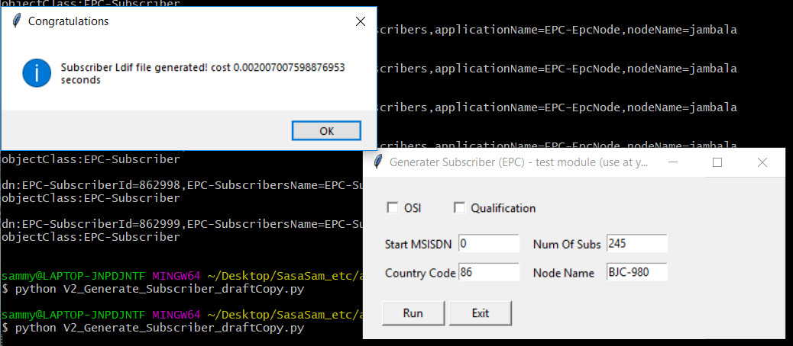

# EPC.sub
Subscribers info (dn) generator
===

Python v3 revision
---

```
#import tkMessageBox
from tkinter import messagebox
```

So Python v2 uses tkMessageBox, while messagebox is part of the tkinter in Python V3.

When you run the program, see the screenshot below:

